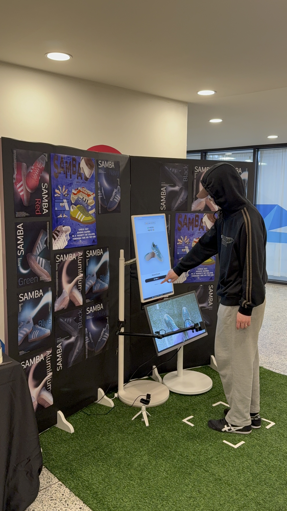

<!-- =========================
     Kerencia / Wear Lab README
     ========================= -->

# 👟 Wear Lab — 신발 마모도 체험 + AR 착화 전시
**Capstone Design 1 | Team Kerencia (케렌시아)**

🎬 **소개 영상(YouTube)**: https://youtu.be/G521t-9eQb0  
📄 **전시 매뉴얼(PDF)**: `캡스톤1_매뉴얼(케렌시아).pdf` *(repo에 포함 권장)*

 

<!-- 배너 이미지 없으면 위 줄 삭제해도 됨 -->

---

## ✨ 프로젝트 소개
**Wear Lab**은 관람객이 터치스크린으로 체험을 시작한 뒤,  
**신발 마모도를 AI로 측정**하고 그 결과에 따라 **AR로 추천 신발을 착화 체험**할 수 있는 인터랙티브 전시입니다.  
마지막에는 QR을 통해 **구매 페이지로 연결**되어 실제 행동(구매/탐색)까지 이어지도록 설계했습니다.

---

## 🧭 체험 흐름 (Experience Flow)
전시는 아래 순서로 진행됩니다.

- **STEP 1 — 터치스크린으로 체험 시작**  
- **STEP 2 — 신발 마모도 측정 (AI 분석)**  
- **STEP 3 — AR 착화 추천**  
- **STEP 4 — 색상 비교 (G컬러)**  
- **STEP 5 — 선택 및 구매 연결 (QR)**  

> 위 흐름은 팀 케렌시아 매뉴얼의 Step 구성과 동일합니다.

---

## 🖼️ 스크린샷 / 전시 사진
> 아래 이미지는 예시 경로입니다. `assets/`에 이미지 넣고 경로만 맞춰주세요.

  
  
  
  
     

 

  
  
  

---

## 🧱 시스템 구성 (Architecture)
> AR 신발 구현
AR 신발 착화 기능은 **Snap Lens Studio**에서 제공하는 **Foot Tracking 모델**을 기반으로 구현하였습니다. 본 작품에서는 별도의 신체 인식 모델을 직접 학습하기보다는, 실제 전시 환경에서의 안정성과 실시간 반응성을 우선적으로 고려하여 검증된 트래킹 모델을 활용하였습니다.

