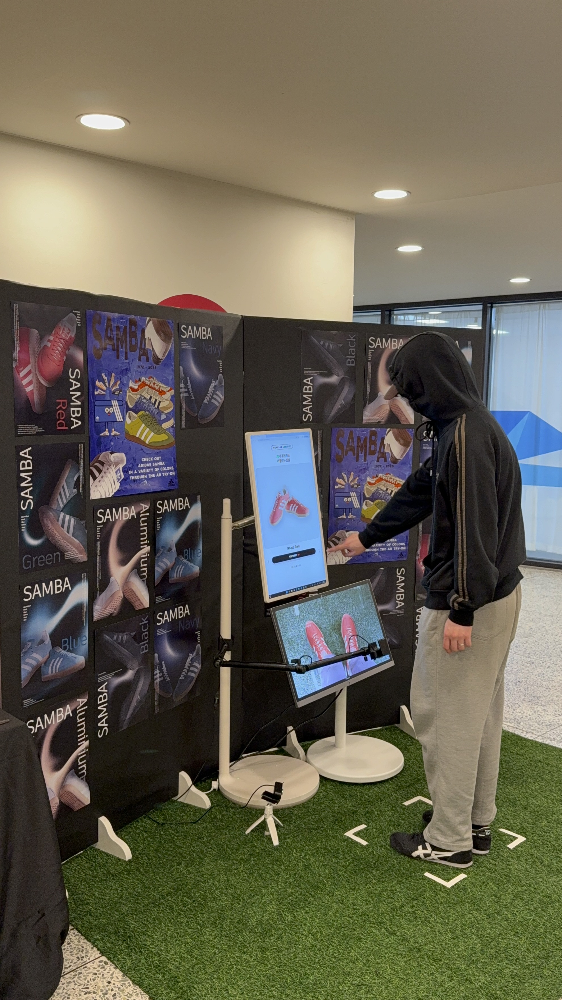

# 👟 Wear Lab — 신발 마모도 체험 + AR 착화 전시
**Capstone Design 1 | Team Kerencia (케렌시아)**

🎬 **소개 영상(YouTube)**: https://youtu.be/G521t-9eQb0  
📄 **전시 매뉴얼(PDF)**: `Project Proposal.pdf`

 

  

---

## ✨ 프로젝트 소개
**Wear Lab**은 관람객이 터치스크린으로 체험을 시작한 뒤,  
**신발 마모도를 AI로 측정**하고 그 결과에 따라 **AR로 추천 신발을 착화 체험**할 수 있는 인터랙티브 전시입니다.  
마지막에는 QR을 통해 **구매 페이지로 연결**되어 실제 행동(구매/탐색)까지 이어지도록 설계했습니다.

---

## 🧭 체험 흐름 (Experience Flow)
전시는 아래 순서로 진행됩니다.

- **STEP 1 — 터치스크린으로 체험 시작**  
- **STEP 2 — 신발 마모도 측정 (AI 분석)**  
- **STEP 3 — AR 착화 추천**  
- **STEP 4 — 색상 비교 (G컬러)**  
- **STEP 5 — 선택 및 구매 연결 (QR)**  

> 위 흐름은 팀 케렌시아 매뉴얼의 Step 구성과 동일합니다.

---

## 🖼️ 스크린샷 / 전시 사진

  
  
  
  

 

  

---

## 🧱 시스템 구성 (Architecture)
> AR 신발 구현

AR 신발 착화 기능은 **Snap Lens Studio**에서 제공하는 **Foot Tracking 모델**을 기반으로 구현하였습니다. 본 작품에서는 별도의 신체 인식 모델을 직접 학습하기보다는, 실제 전시 환경에서의 안정성과 실시간 반응성을 우선적으로 고려하여 검증된 트래킹 모델을 활용하였습니다.

  
  

 **Lens Studio의 Foot Tracking 기능**은 카메라 입력을 통해 사용자의 발 위치와 방향을 실시간으로 추적하며, 이를 기준으로 3D 신발 모델을 화면 상의 발에 자연스럽게 정렬합니다. 이를 통해 관람자는 별도의 마커나 추가 장비 없이도 AR 신발 착화 체험을 즉각적으로 수행할 수 있습니다. 본 작품에서는 이 트래킹 결과에 **아디다스 삼바 3D 모델**을 연동하여, 발 움직임에 따라 신발이 함께 반응하도록 구성하였습니다.

  
  

  또한 본 시스템은 PC 환경에서의 전시 운영을 고려하여 Snap Camera Kit Web SDK 기반 환경에 최적화되었으며, 웹캠을 활용한 실시간 트래킹이 안정적으로 이루어지도록 구성하였습니다. 이를 통해 전시 공간에서도 반복적인 체험과 장시간 운영이 가능한 AR 착화 환경을 구현하였습니다.

